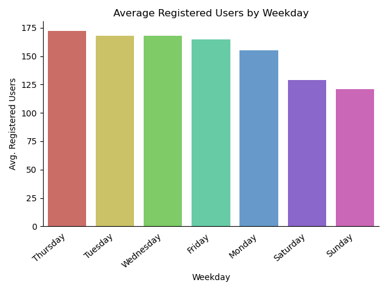
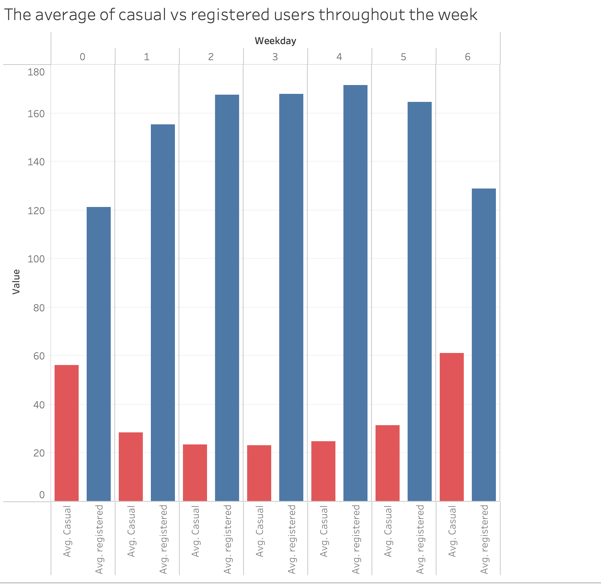

# COSC 301 Group 14 Final Report

## Members

Zaynb Alkhafadi, Connor Doman, Jan Suratos

## Introduction

The dataset we chose was the ride sharing data provided by [Capital Bikeshare](https://capitalbikeshare.com), a Washington D.C. based company. This company is similar to [Lime](https://www.li.me/en-ca/vehicles/scooter) or [Citi Bike](https://citibikenyc.com) in that they deploy bicycles around the city and users can rent them freely from a mobile app or kiosk. The data was collected over two years, between January 1, 2011 and December 31, 2012. It's healthier and cheaper to minimize the use of cars in daily commutes and these services work to improve the walkability factor of cities.

## Exploratory Data Analysis

### Highlights

In support of walkable cities, it was nice to see that ridership trended upwords across the two years.

Despite being an easy prediction, it was interesting to find that ridership goes up Monday–Friday. It was also interesting to see that registered ridership drops during the weekend, likely since these users are mostly doing so for work.

## Question 1 (Connor)

### Results

## Question 2 (Jan)

### Results

## Question 3 (Zaynb)
The differences between casual vs registered users. 
### Results

It's shown in the Figure above titled "The average of casual vs registered users throughout the week", that a much larger proportion of weekday users are registered users, and this makes sense as those who commute would benefit from the convenience of registration. The inverse is also true: a greater proportion of casual riders rent on the weekend.

 In the second Figure titled "which month had the lowest amount of bike rentals between registered and casual users", theres a trendline for registered users: more and more are becoming registered throughout the months. Casual users have their peaks during the warmer seasons, and their lows throughout the colder ones. [You can find the full analysis notebook here, including the code and the data here.](http://localhost:8888/lab/tree/notebooks/analysis3.ipynb)

## Summary Conclusion
