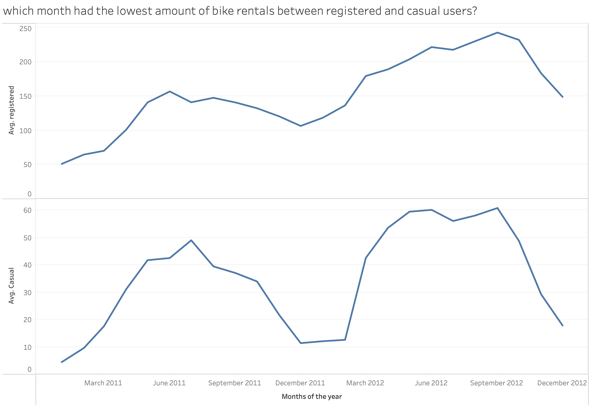

# COSC 301 Group 14 Final Report

## Members

Zaynb Alkhafadi, Connor Doman, Jan Suratos

## Introduction

The dataset we chose was the ride sharing data provided by [Capital Bikeshare](https://capitalbikeshare.com), a Washington D.C. based company. This company is similar to [Lime](https://www.li.me/en-ca/vehicles/scooter) or [Citi Bike](https://citibikenyc.com) in that they deploy bicycles around the city and users can rent them freely from a mobile app or kiosk. The data was collected over two years, between January 1, 2011 and December 31, 2012. It's healthier and cheaper to minimize the use of cars in daily commutes and these services work to improve the walkability factor of cities.

## Exploratory Data Analysis

### Highlights

In support of walkable cities, it was nice to see that ridership trended upwords across the two years.

Despite being an easy prediction, it was interesting to find that ridership goes up Monday–Friday. It was also interesting to see that registered ridership drops during the weekend, likely since these users are mostly doing so for work.

## Question 1 (Connor)

> _What holidays have the most bike rentals?_

### Results

D.C. is a unique location in the United States for holidays. Being the political center of the country, as well as the region in which the Department of Defense is headquartered, Washington sees more patriotic activity than average. Subsequently, in my analysis I found the holiday with the single most bikes rented was Independence Day, 2012.

Surprisingly, the next most popular holiday was April 16, 2012. This did not come up as a holiday on most typical calendars, but according to [this article](https://www.timeanddate.com/holidays/us/2012) on _Time and Date_, DC celebrates this day as Emancipation Day. This again follows patriotism expected from the location. This is also Orthodox Easter Monday, but this seems less likely to be widely celebrated in Washington. An interesting observation is that this same day in 2011 had only 49% the ridership of 2012 (3126 vs. 6370).

#### Weather

_Please note, the researcher defines weather values as follows:_

-   1: Clear, Few clouds, Partly cloudy, Partly cloudy
-   2: Mist + Cloudy, Mist + Broken clouds, Mist + Few clouds, Mist
-   3: Light Snow, Light Rain + Thunderstorm + Scattered clouds, Light Rain + Scattered clouds
-   4: Heavy Rain + Ice Pallets + Thunderstorm + Mist, Snow + Fog

A possible explanation for this disproportionate response is the weather on that day. According to the figures above, the weather in March was approximately the same as that of April, but the average temperature was about 4°C warmer (15.6° vs. 19.5°). If this is not the explanation, the difficulty in finding an answer as to what the holiday on April 16th was might indicate the data collector incorrectly entered this date as a holiday.

## Question 2 (Jan)

### Results

## Question 3 (Zaynb)

The differences between casual vs registered users.

### Results

It's shown in the Figure above titled "The average of casual vs registered users throughout the week", that a much larger proportion of weekday users are registered users, and this makes sense as those who commute would benefit from the convenience of registration. The inverse is also true: a greater proportion of casual riders rent on the weekend.

In the second Figure titled "which month had the lowest amount of bike rentals between registered and casual users", theres a trendline for registered users: more and more are becoming registered throughout the months. Casual users have their peaks during the warmer seasons, and their lows throughout the colder ones. [You can find the full analysis notebook here, including the code and the data here.](http://localhost:8888/lab/tree/notebooks/analysis3.ipynb)

## Summary Conclusion
